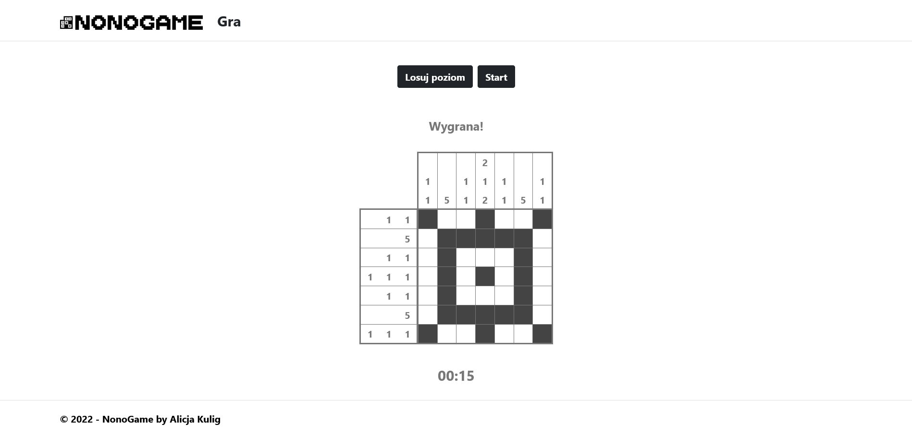

# NonoGame
NonoGame is a web app written with ASP.NET Core. It is based on Nonogram - a puzzle in which cells of a grid must be filled or left blank, according to sets of numbers given at the side of the grid, to reveal a hidden picture.

## Table of contents
* [Technology](#technology)
* [Installation](#installation)
* [Screenshots](#screenshots)


## Technology
Project is created with:
* ASP.NET Core 6
* C#
* SQL Server
* JavaScript
* jQuery
* Bootstrap 5

## Installation

1. Clone the repository
	```
	git clone https://github.com/Alakul/NonoGame.git
	```

2. Open project with Visual Studio 2022

3. Run migrations
	```
	Update-Database
	```


## Screenshots
<p>
    
    <em>Game</em>
</p>